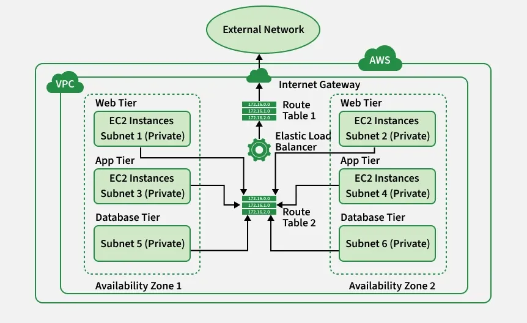

# AWS Core Services Documentation

*Based on AWS Full Notes PDF*

---

# Table of Contents

1. AWS VPC (Virtual Private Cloud)
2. AWS EC2 (Elastic Compute Cloud)
3. AWS S3 (Simple Storage Service)
4. AWS RDS (Relational Database Service)
5. AWS IAM (Identity and Access Management)

---

# 1. AWS VPC (Virtual Private Cloud)

## Overview

Amazon VPC (Virtual Private Cloud) is the core AWS networking service that allows users to create a logically isolated private network inside AWS Cloud.

VPC allows you to:

* Define your own IP address range
* Create subnets
* Configure routing
* Control security
* Connect AWS resources securely


---

## Purpose of VPC

VPC is used to:

* Create private cloud networks
* Isolate workloads
* Control traffic routing
* Secure AWS resources
* Organize application infrastructure

---

## VPC Components

According to the document, VPC networking includes several major components. 

```text
VPC
├── CIDR Block
├── Public Subnet
├── Private Subnet
├── Route Table
├── Internet Gateway
├── Security Group
└── Network ACL
```

---

## Subnets

Subnets divide the VPC network into smaller sections.

### Public Subnet

Internet accessible subnet.

Examples:

* Public EC2
* Load Balancer
* Bastion Host

### Private Subnet

No direct internet access.

Examples:

* Application Servers
* Databases

The PDF explains that public subnets can route traffic to and from the internet, while private subnets remain isolated. 

---

## Internet Gateway (IGW)

Internet Gateway allows communication between VPC and internet.

### Purpose

Provides:

* Outbound internet access
* Inbound internet access

---

## Route Tables

Route tables control traffic routing inside VPC.

Example:

```text
Destination        Target

10.0.0.0/16        Local
0.0.0.0/0          Internet Gateway
```

Every subnet must be associated with a route table. 

---

## Security Groups

Security Groups work as instance-level firewalls.

Controls:

* Inbound Traffic
* Outbound Traffic

Characteristics:

* Stateful firewall
* Instance level protection

Your notes explain that Security Groups allow inbound and outbound traffic management for EC2 instances. 

---

## Network ACL (NACL)

NACL works at subnet level.

Characteristics:

* Stateless firewall
* Allow rules
* Deny rules

Used to filter subnet traffic.

---

## VPC Resource Connection Flow

```text
Internet
   ↓
Internet Gateway
   ↓
Route Table
   ↓
VPC
   ↓
Subnet
   ↓
EC2 / RDS
```

---

## Production Example

```text
Production VPC
├── Public Subnet
│   ├── ALB
│   └── Bastion Host
│
└── Private Subnet
    ├── EC2 Application Server
    └── RDS Database
```

---

# 2. AWS EC2 (Elastic Compute Cloud)

## Overview

Amazon EC2 provides resizable virtual servers inside AWS Cloud.

The PDF defines EC2 as a virtual server service that allows users to rent computing capacity without managing physical hardware. 

---

## Purpose of EC2

Used for:

* Website Hosting
* APIs
* Backend Applications
* CI/CD Servers
* Development Environments
* Data Processing

---

## EC2 Components

Your document covers the following EC2 components. 

```text
EC2
├── AMI
├── Instance Type
├── Key Pair
├── Security Group
├── EBS
├── Elastic IP
└── Load Balancer
```

---

## AMI (Amazon Machine Image)

AMI is a template used for launching EC2 instances.

Contains:

* Operating System
* Applications
* Configuration
* Metadata

Examples:

* Ubuntu
* Amazon Linux
* Windows Server

---

## Instance Types

AWS provides multiple instance families.

Examples from the PDF:

* General Purpose
* Compute Optimized
* Memory Optimized
* Storage Optimized
* Accelerated Computing

Different instance types provide different CPU, memory, and networking capabilities. 

---

## Key Pairs

Key pairs enable secure login into EC2 instances.

Components:

* Public Key
* Private Key

Purpose:

SSH authentication.

Example:

```bash
ssh -i server.pem ubuntu@PUBLIC-IP
```

---

## Elastic IP

Elastic IP is a static public IP address.

Benefits:

* Persistent public address
* Survives instance restart
* Stable endpoint

The PDF explains Elastic IP allocation and association with EC2 resources. 

---

## EBS (Elastic Block Store)

EBS provides storage for EC2.

Stores:

* Operating System
* Application Files
* Logs
* Database Data

The document explains EBS volumes and snapshots as persistent storage mechanisms for EC2 instances. 

---

## EC2 Resource Connection Flow

```text
User
 ↓
Route53
 ↓
Load Balancer
 ↓
Target Group
 ↓
EC2 Instance
 ↓
Application
```

---

## EC2 Architecture Example

```text
Internet
   ↓
Load Balancer
   ↓
EC2 Web Servers
   ↓
Database
```

---

# 3. AWS S3 (Simple Storage Service)

## Overview

Amazon S3 is AWS object storage service.

The uploaded document lists S3 as one of the core AWS services covered in the notes. 

---

## Purpose of S3

Used for:

* File Storage
* Backup Storage
* Media Storage
* Static Websites
* Log Storage

---

## S3 Components

```text
S3
├── Bucket
├── Objects
├── Object Metadata
├── Permissions
└── Versioning
```

---

## Buckets

Buckets are logical containers.

Store:

* Images
* Videos
* Documents
* Logs
* Backups

---

## Objects

Objects are stored files inside buckets.

Every object contains:

* File Data
* Metadata
* Unique Key

---

## S3 Access Control

Access can be controlled using:

* IAM Policies
* Bucket Policies
* Permissions

---

## S3 Connection Flow

```text
Application
   ↓
IAM Permission
   ↓
S3 Bucket
   ↓
Stored Files
```

---

## Production Example

```text
Users
   ↓
Backend API
   ↓
S3 Bucket
   ↓
Uploaded Media Files
```

---

# 4. AWS RDS (Relational Database Service)

## Overview

Amazon RDS is AWS managed relational database service.

The PDF includes RDS among the core AWS services discussed in the document. 

---

## Purpose of RDS

Used for managed databases.

Supports:

* MySQL
* PostgreSQL
* MariaDB
* Oracle
* SQL Server

---

## Benefits

RDS helps reduce operational work by handling:

* Provisioning
* Maintenance
* Backups
* Monitoring
* Scaling

---

## RDS Deployment Pattern

Typically deployed inside private subnet.

Example:

```text
VPC
├── Public Subnet
│   └── Load Balancer
│
└── Private Subnet
    ├── EC2 Application
    └── RDS Database
```

---

## RDS Resource Connections

```text
Application Server
      ↓
Security Group
      ↓
RDS Endpoint
      ↓
Database Engine
```

---

## Production Example

```text
Users
 ↓
Load Balancer
 ↓
EC2 Application Server
 ↓
RDS Database
```

---

## Security Best Practices

Recommended:

* Private Subnet Deployment
* Security Group Restrictions
* Automated Backups

---

# 5. AWS IAM (Identity and Access Management)

## Overview

AWS IAM manages authentication and authorization.

The uploaded PDF includes IAM as a core AWS service. 

---

## Purpose of IAM

Controls access to AWS resources.

Manages:

* Users
* Groups
* Roles
* Policies

---

## IAM Components

```text
IAM
├── Users
├── Groups
├── Roles
└── Policies
```

---

## IAM Users

Individual identities.

Examples:

* Developers
* DevOps Engineers
* Administrators

---

## IAM Groups

Collection of users.

Example:

```text
Developers Group
├── User1
├── User2
└── User3
```

---

## IAM Roles

Temporary permission mechanism.

Commonly used by:

* EC2
* Lambda
* Applications

---

## IAM Policies

Permission documents written in JSON.

Define:

* Allowed Actions
* Resources
* Conditions

---

## IAM Resource Connection Flow

### EC2 Accessing S3

```text
EC2 Instance
    ↓
IAM Role
    ↓
IAM Policy
    ↓
S3 Bucket Access
```

---

### Lambda Accessing RDS

```text
Lambda Function
      ↓
IAM Role
      ↓
RDS Permission
      ↓
Database Access
```

---

## Production Best Practices

Use:

* Least Privilege Access
* MFA
* Roles Instead of Access Keys
* Separate IAM Users by Responsibility

---

# Complete AWS Architecture Flow

```text
User
 ↓
Internet
 ↓
Route53
 ↓
Load Balancer
 ↓
VPC
 ├── Public Subnet
 │      ↓
 │     EC2
 │
 └── Private Subnet
        ↓
       RDS

IAM → EC2 → S3
```

---

# Conclusion

These AWS services work together to build secure, scalable, and highly available cloud applications.

Relationship between services:

```text
VPC → Network Foundation
EC2 → Compute Layer
S3 → Object Storage
RDS → Database Layer
IAM → Access Control Layer
```

This document is prepared using the concepts covered in your uploaded AWS Full Notes PDF. 
